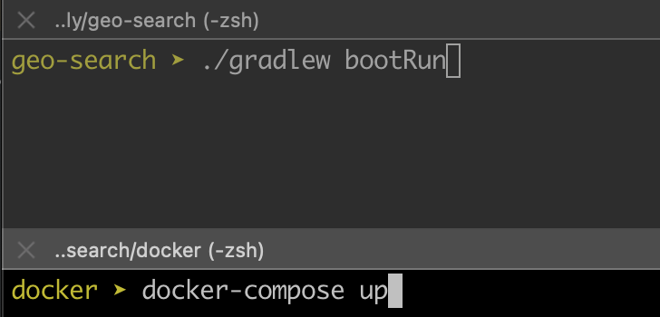
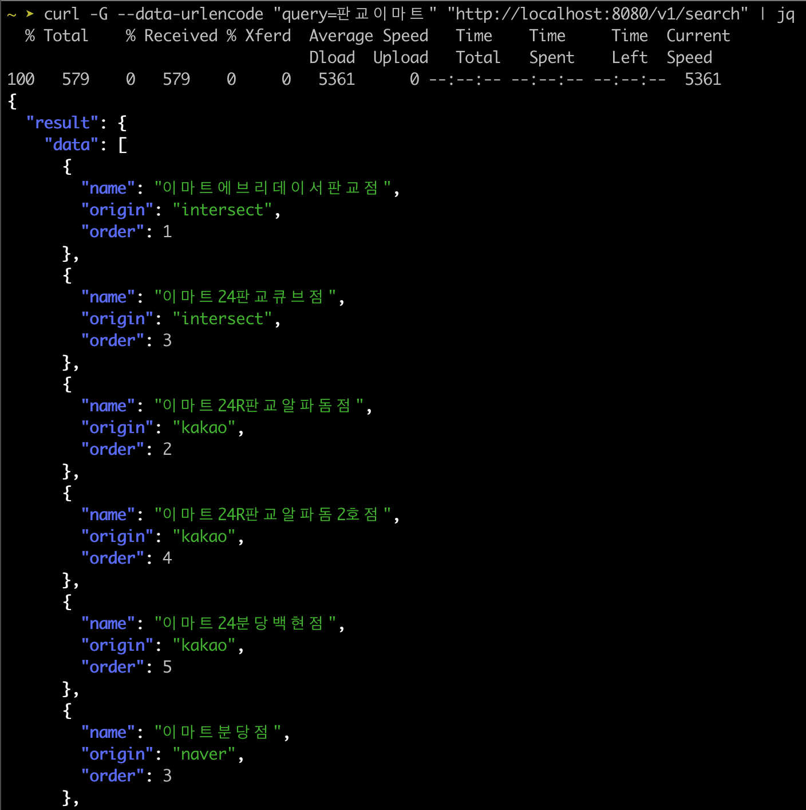
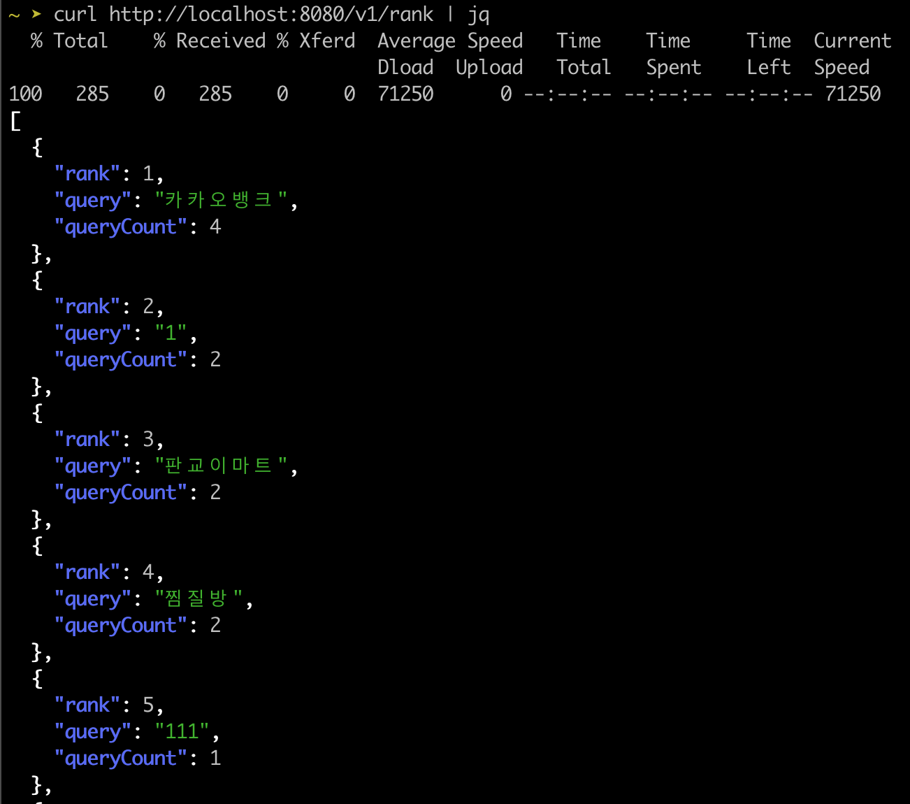
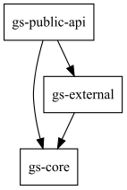

## GeoSearch

## 개발 환경

- VERSION_11 (Amazon Corretto version 11.0.11 )
- Gradle
- Spring Boot 2.5.9
- Spring Cloud 2020.0.5
    * Cloud 2020 과 Boot 2.5.lateset 를 선택함 [버전 호환 정보](https://spring.io/projects/spring-cloud)
- Kafka, Prometheus, Zipkin (docker-compose 로 제공)

## 실행방법

1. docker 폴더에서 docker-compose 를 실행해주세요.
   ```
    docker>  docker-compuse up -d
   ```
2. geo-search 디렉토리에서 gradlew bootRun 을 실행해주세요
   ```
      > ./gradlew bootRun
   ```
1. 참고    
   

## 테스트

> gradlew bootRun 으로 실행하면 `http://localhost:8080/docs/index.html` 으로 문서를 참고할 수 있습니다. <br/>
> 또는 `geo-search-api-test.http` 파일로 확인 가능합니다.

1. 쿼리호출
   ```
   curl -G --data-urlencode "query=판교이마트" \
      "http://localhost:8080/v1/search"
   ```  
   또는 브라우저에서 [http://localhost:8080/v1/search?query=판교이마트](http://localhost:8080/v1/search?query=판교이마트)

   

1. 랭킹 조회
   ```
      curl http://localhost:8080/v1/rank
   ```
   또는 브라우저에서 [http://localhost:8080/v1/rank](http://localhost:8080/v1/rank)
   

## 구조(module)



1. gs-core
    * 비지니스로직
    * 외부 API, 저장소들을 호출하는 인터페이스(Port)가 정의되어 있다
1. gs-external (infra)
    * API : 네이버, 카카오 API 클라이언트가 구현되어 있다.
    * 랭킹 저장소(RankingRepository)가 구현되어 있다.
    * 랭킹 저장소에 랭킹 정보를 제공할 PutQueryCountPort 가 구현되어 있다
1. gs-public-api
    * RestAPI 를 구현하였다
    * /v1/search/{query}
    * /v1/rank

## 프로젝트 구현 내용
* [코드구현](docs/CODE1.md)
* [사용 라이브러리](docs/LIBRARY.md)

## 그 외에 추가 내용
* [구글 API가 추가된다면?](docs/EXT1.md)
* [개발과 운영을 위한 추가 적인 내용](docs/EXT2.md)