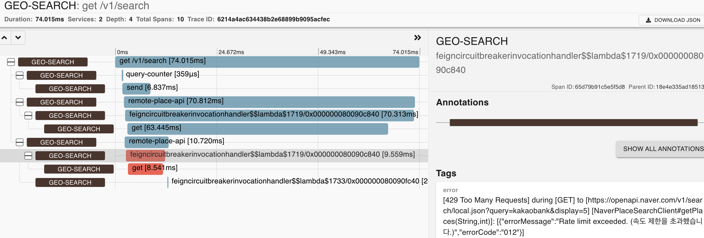
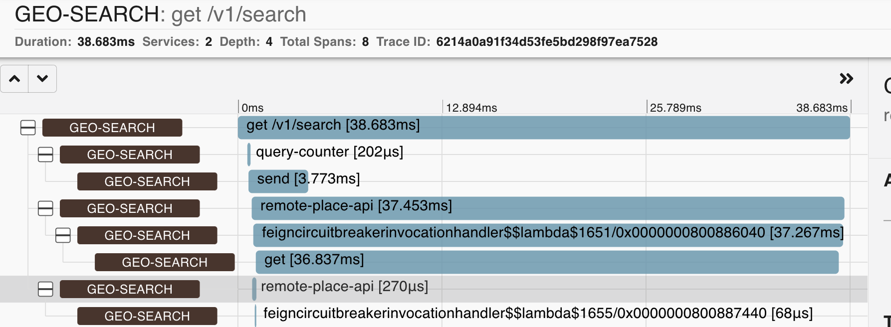
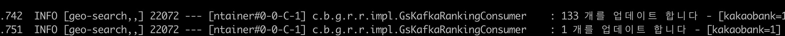

### ㅁ 검색 결과에서 '장소'는 어떤 기준으로 일치한지?

* 문제의 단순화
    * 문제에서 '동일한 장소인지 판독'하는 여부는 주요 이슈가 아니라고 판단함
    * 단순하게 "장소명" 만을 대상으로 일치 여부를 판단하였다.

* 장소명에 대한 필터링
    * `PlaceNameFilter extends UnaryOperator<String>` 을 구현하는 `TagNameFilter(html 제거)` , `WhiteSpaceFilter(공백 제거)` 2개를 기본
      제공
    * 추후에 '장소명'에 관한 다른 룰이 적용될 것을 고려해서 PlaceNameFilter 를 체이닝

### ㅁ 원격 API 호출에 대한 고려사항은?

다양한 케이스가 있겠지만 기본적인 몇가지만 고려하였다.

* 응답시간 등의 지연은 feign 설정으로 관리함
* 연속적인 포털API 장애는 circuit breaker 패턴을 적용함
* 특정 API 가 장애가 나더라도 fallback을 통해 정상 데이터만 반환하도록 fallback 적용

* 아래의 내용은 네이버 API 가 정상적인 응답을 주지 않았을 때 fallback 으로 빈 배열을 선언하고 정상적인 응답을 반환한 경우이다.
  
* 아래의 내용은 네이버 API 서킷이 열려서 fallback 이 된 상태이다.

> [ool-2-thread-42] c.b.g.r.a.i.n.NaverPlaceClientFallBack   : kakaobank fallback

### ㅁ 동시에 여러개의 API 를 호출하는 방법은?

`각 API 의 응답 시간을 100ms 으로 가정한다`

* 카카오, 네이버를 순차 호출 하면 200ms 가 걸린다.
    * 카카오가 실패할 경우 '네이버'를 호출하지 않는 등의 처리가 가능하지만
    * 각 API 실행은 독립 수행이기 때문에 동시에 호출한다면 서비스 응답 시간이 줄어들 것이다.
* 동시 호출로 변경
    * 단점) Threadpool 이 도입되어서 모니터링의 복잡해짐 (brave 의 추가)
    * 단점) 시퀀스 방식에 의해서 디버깅이 복잡해짐
    * 장점) 서비스 API 에서 중요한 응답시간이 짧아짐

### ㅁ 랭킹 정보는 저장하였는가?

* '쿼리, 호출횟수'를 저장하는 Default Repository 를 구현
* ConcurrentHashMap 기반으로 구현 한 뒤 추후에 LongAdder 로 변경하였으나 드라마틱한 차이를 못 봄

### ㅁ 랭킹 조회의 부하는 ?

* 실시간으로 랭킹 조회가 들어올 때마다 모든 쿼리셋을 대상으로 랭킹을 구해야하니 효율적이지 않다.
* 추가로 구현을 한다면
    * RankingRepository 의 데이터를 주기적으로 긁어와서 1-100 위 정보를 미리 계산해 놓는 RankingView 를 만들었을 것이다.
    * 데이터를 실시간으로(건 바이 건) RankingView를 만드는 것은 좋은 생각 같지는 않다.
    * 랭킹데이터는 부하를 줄이기 위해 배치성으로 업데이트를 했다(메시지 컨슈밍을 조절)
      

* 검색 카운팅을 저장하는 `increse(String query, long count)` 부분에는 동시성에 대한 고려를 했다.

### ㅁ KafkaProducer 를 썼어야 하는가?

* 장소 검색을 하는 API 내에 쿼리 호출을 적재하는 방법은 AOP 나 GetPlaceService 를 wrap 하는형태로 분리 하면 좋았을 듯 하다.
* Producer.send 가 async 하더라도 '카프카 클러스터'가 존재해야하는 제약 조건이 있다.  
  선호하는 방식은 logging 으로 떨어트리고 filebeat과 별도의 데몬으로 이벤트를 전송하는 방식을 더 선호한다.
  (신경 쓸 부분은 더 많지만 카프카등의 이슈로 '장소 조회' 서비스에 문제가 일어날 여지가 더 줄어든다)
