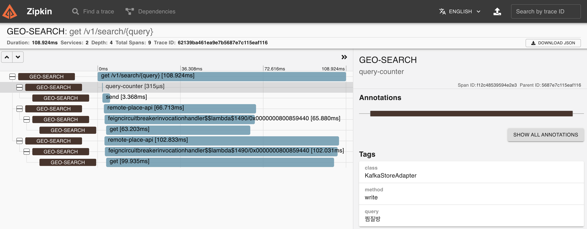

### Question.

> 개발과 운영을 위한 추가 적인 내용

#### TestReport & Jacoco

#### Restdoc 문서

---

#### ZIPKIN 추가

* 상용 서비스인 datadog 못지 않게 강력한 트레이싱 정보를 확인 할 수 있다.
* 아래는 하나의 커스텀 태그, 카프카 메시지 전송, 2개의 API 동시 호출 하는 부분을 확인 할 수 있다.
  

* 아래는 네이버 API 가 잘못된 응답을 반환 해준 것을 확인 할 수 있다
  

#### Grafana 추가

* geo-search 는 prometheus, micrometer 를 이용해 다양한 메트릭을 표현해주고 있다.
* 이 메트릭 정보를 prometheus 로 수집하여 grafana 로 볼 수 있다

* actuator 와 micrometer 를 이용해서 기본적으로 Request, WebFlux, Cache 등의 메트릭을 수집해준다. 그러한 것들을 대시보드로 구축하여 운영하거나, alerting과 연계하여
  관제용으로 사용 할 수 있다.
  

* 아래는 feign-micrometer 를 이용해서 feign 정보를 노출한것이다. 물론 MeterRegistry 와 Guage 등을 통해서 인프라 메트릭 뿐 아니라 비지니스(서비스)로직의의 metric 도
  수집가능하다
  