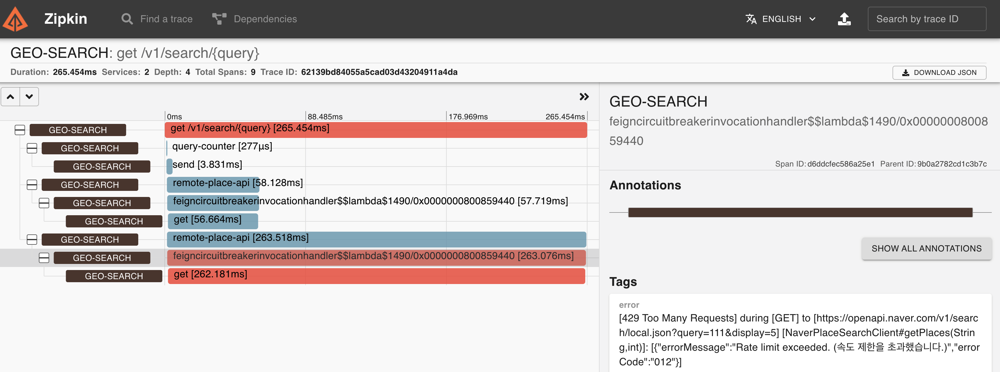
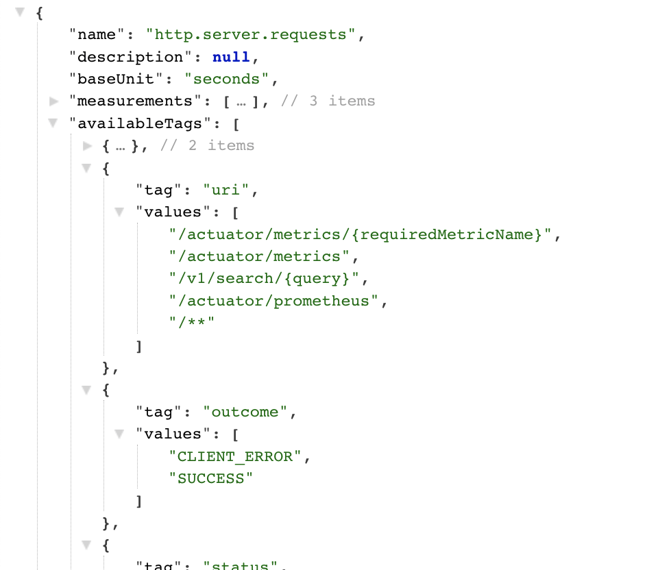

### 라이브러리

#### feign

```
implementation 'io.github.openfeign:feign-micrometer'
implementation 'org.springframework.cloud:spring-cloud-starter-openfeign'    
```

* 간편하게 사용할 수 있는 REST Client 이다.
* [링크](https://spring.io/projects/spring-cloud-openfeign) 스프링 클라우드에 인테그레이션 되어 있어서 어노테이션과 property 기반으로 쉽게 사용가능하다. 그래서
  hystrix, resilience4j, micrometer등과도 편히 사용 가능하다

#### resilience4j

```
implementation 'org.springframework.cloud:spring-cloud-starter-circuitbreaker-resilience4j'
```

* 스프링에서는 다양한 Circuit Breaker 를 지원한다. 더이상은 개선이 되지 않지만 아직까지는 hystrix를 많이 쓰이고 있고, 신규 프로젝트에서는 resilience4j 를 쓴다
* feign 과 함께 사용할 수 있도록 잘 연동되어 있고 [문서](https://resilience4j.readme.io/docs/feign)도 훌륭하다.
* feign 과 resilience4j 를 사용하여 REST API를 호출하면 아래처럼
  
* 순수하게 resilience4j나 feign 이 아닌 spring cloud 의 `org.springframework.cloud.openfeign.FeignCircuitBreaker' 에 의해
  CircuitBreaker(Supplier) 형태로 수행된다.

#### Micrometer

```
implementation 'org.springframework.boot:spring-boot-starter-actuator'
implementation 'io.micrometer:micrometer-registry-prometheus'
```

* [공식 문서](https://docs.spring.io/spring-boot/docs/current/reference/html/actuator.html)
* SpringBoot 에 포함된 하나의 모듈로 모니터링이나, 운영에 필요한 여러 기능을 포함한다.</br>
  기본적으로 메트릭을 위한 facade library 인 micrometer 를 포함하여, SimpleMeterRegistry를 이용해 메트릭 정보를 수집한다 </br>
  `/actuator/metrics` 엔드포인트와 tag 등을 통해 확인 할 수 있다.

* `http://localhost:8080/actuator/metrics/http.server.requests?tag=method:GET` 를 조회하면 아래와 같은 Simple Metric 정보를 확인 할 수 있다
  
* 또한 여러 vendor 들과 통합해서 입맛에 맞는 모니터링 환경 구축에 활용 할 수 있다.

#### restdoc & asciidoctor-extendsion

```
asciidoctorExtensions 'io.spring.asciidoctor:spring-asciidoctor-extensions-block-switch:0.6.0'
testImplementation 'org.springframework.restdocs:spring-restdocs-mockmvc'
```

* Controller 를 기반으로 API document 를 생성해준다

